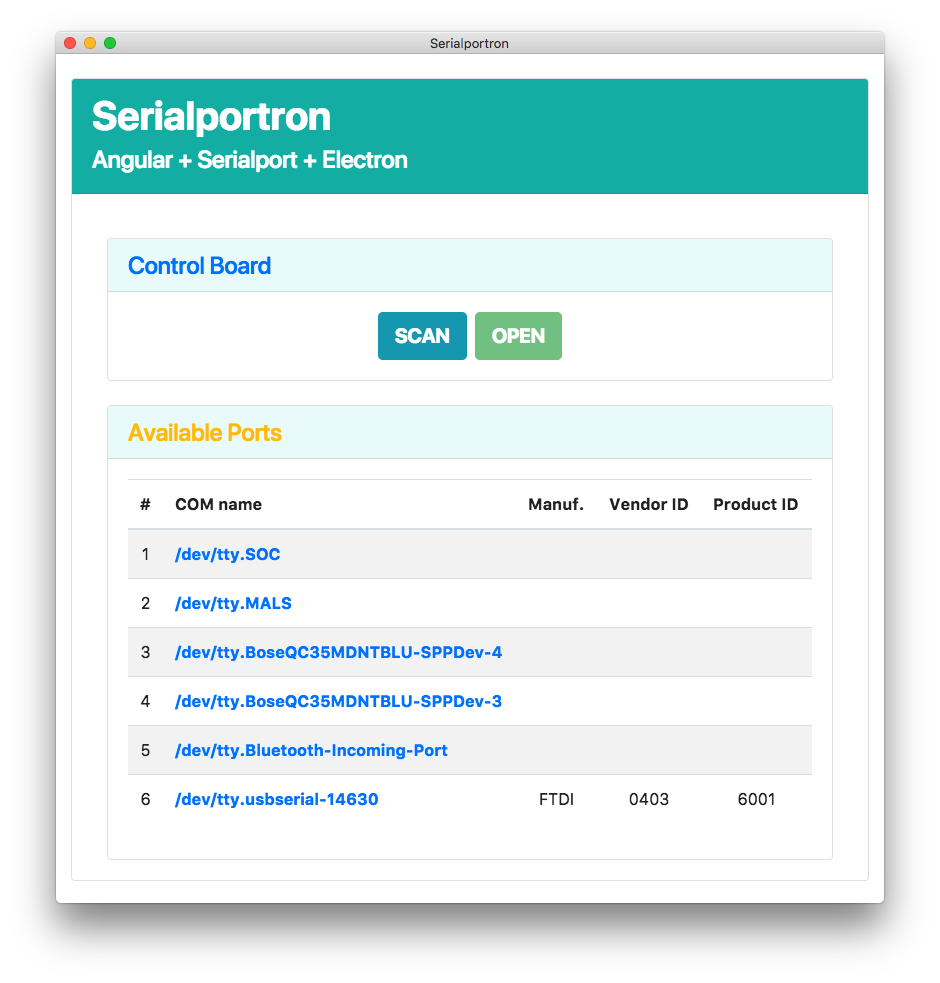
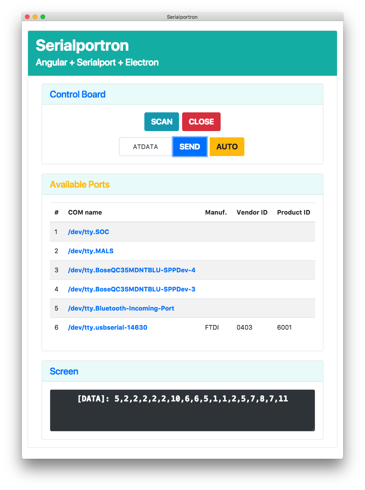

# Serialportron
### Angular + Serialport + Electron + Bootstrap

This is a minimal repo consisting of a boilerplate starter app and an example app to provide quick start on using **Serialport** and **Electron** in an **Angular** app.


## Major Dependencies
* [Angular 7](https://angular.io/)
* [Node Serialport](https://github.com/node-serialport/node-serialport)
* [Electron](https://electron.atom.io/)
* [Boostrap 4](https://getbootstrap.com/)

## Getting Started
```shell
# Install dependencies
npm install

# Launch app in dev mode with live-reload
npm start
```

## Packaging App
```shell
# Build app for production
npm run build:prod

# Build app package for mac
npm run electron:mac

# Build app package for windows
npm run electron:windows

# Build app package for linux
npm run electron:linux
```

* To adjust build options, look into `package.json` and `main.ts` files.

## Screenshots

### Starter App


### Example App


## Video Demo

[](http://www.youtube.com/watch?v=Wf7SAIfr04M "")